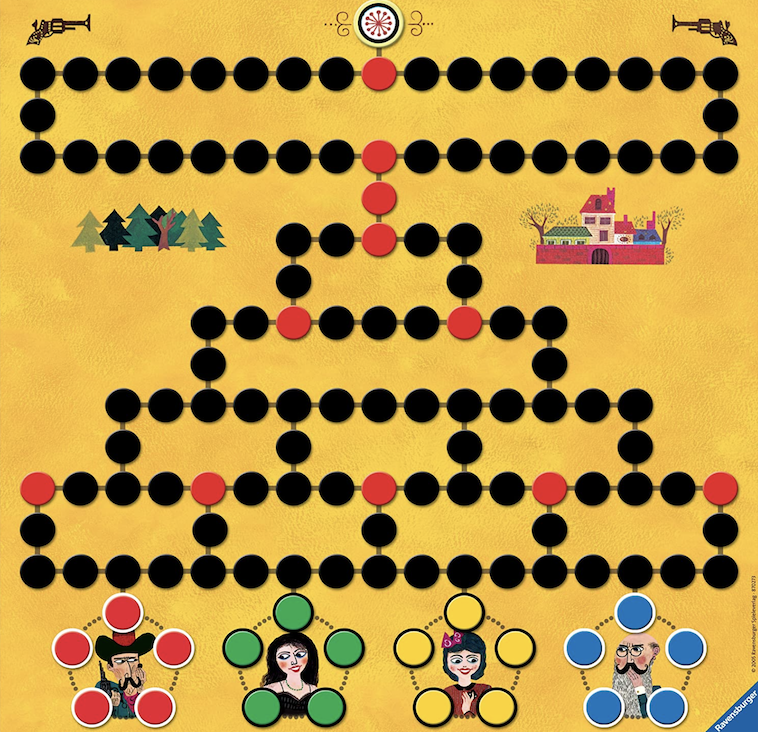

# Htwg Scala Seed Project 

Malefiz

This game was developed by Alban and Robert for the class Software Engeneering at HTWG Konstanz

Gameplay

Two to four (up to six on special game boards) players try to get their five characters from their starting positions down on the board to the top. The number rolled determines how many spaces a player may move forward. The players try to hinder their teammates by throwing them back to the starting point or by putting white blocking stones in their way. In order to hit a blocking stone or an opposing pawn, a player must roll an exact number of dice. As a result, a player may not be able to move any of his blocked characters for several turns.
